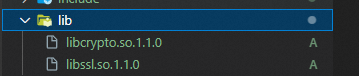
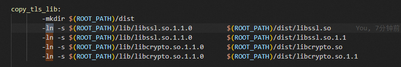
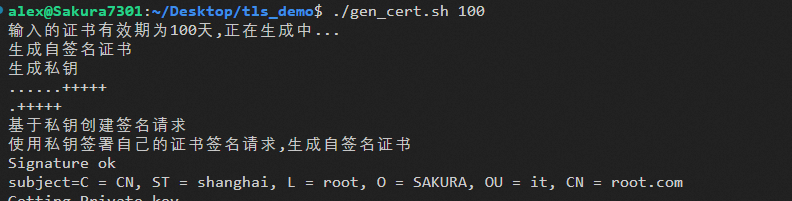
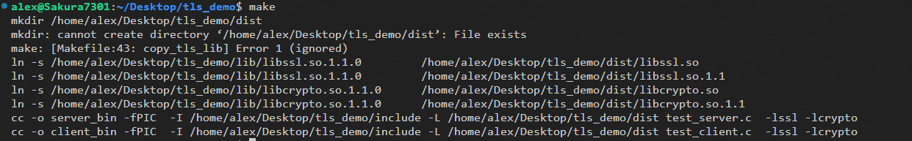
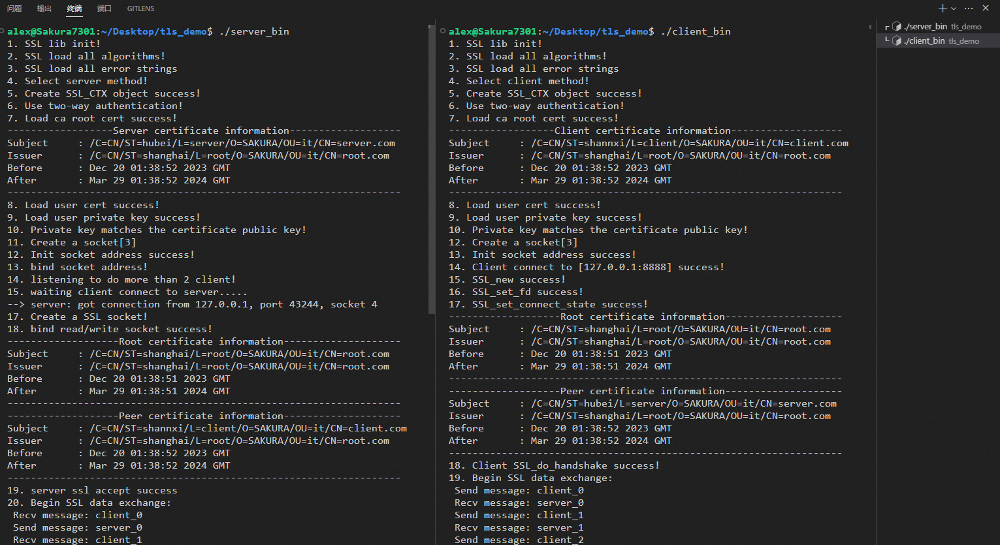

   


### 使用须知

这是一个极简的TLS demo，包括证书的生成、自签名、加载、使用，以及一个写好注释的示例程序(这包括客户端和服务端程序。)

##### 在linux系统构建

动态链接库我放在lib目录下，如果你是其它的版本，你需要使用自己的库，同时你可能需要修改makefile中创建软连接的步骤，如下图所示：



如果你是openssl 1.1.0，那么你可以直接构建它：

##### 1.生成证书

```
./gen_cert.sh [证书的天数]
```



##### 2.编译

```
make
```



##### 3.运行

> 分别使用两个终端去运行`client`和`server`程序。

```
./server
./client
```



